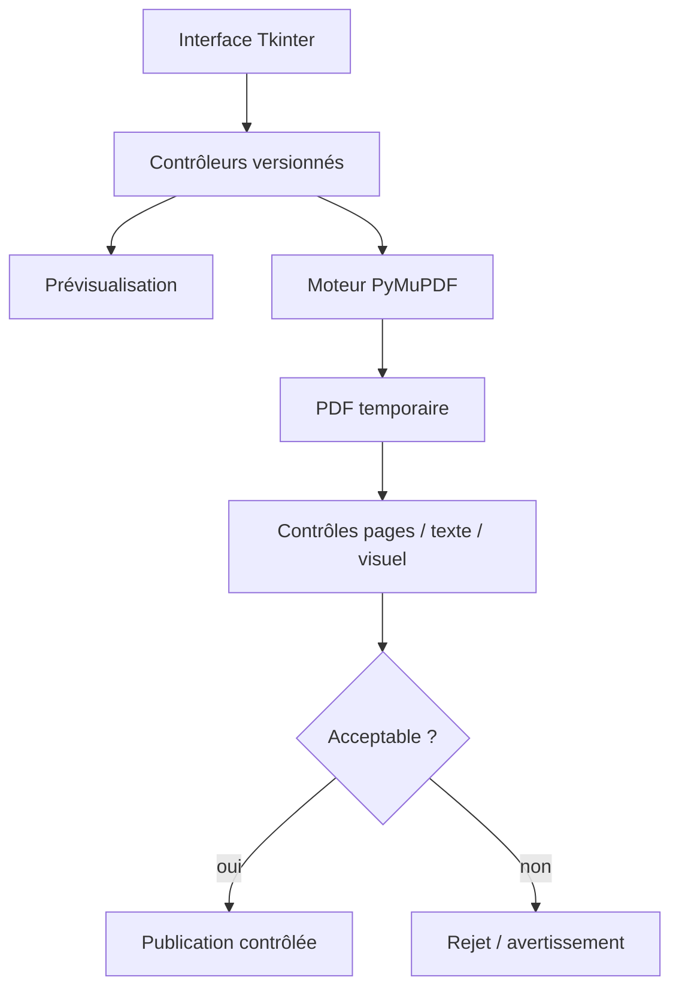

# Architecture V32.9

```mermaid
flowchart TD
 UI[Interface Tkinter] --> CTRL[Contrôleurs versionnés]
 CTRL --> PRE[Prévisualisation]
 CTRL --> ENGINE[Moteur PyMuPDF]
 ENGINE --> TMP[PDF temporaire]
 TMP --> Q[Contrôles pages / texte / visuel]
 Q --> DEC{Acceptable ?}
 DEC -->|oui| PUB[Publication contrôlée]
 DEC -->|non| REJ[Rejet / avertissement]
```

Le module `openpdf_quality_report_v329.py` est un formateur de bilan testable, non une nouvelle API HTTP.
